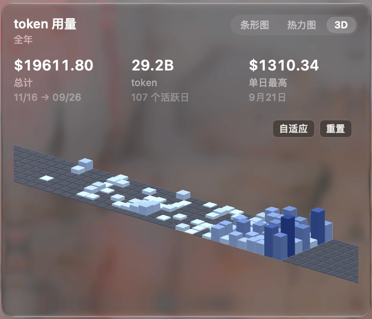
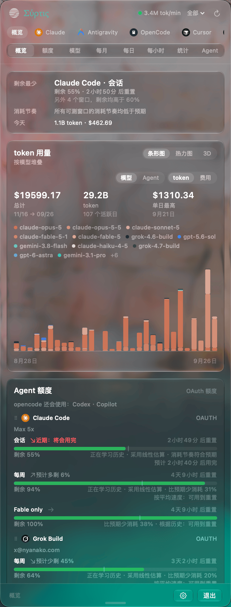
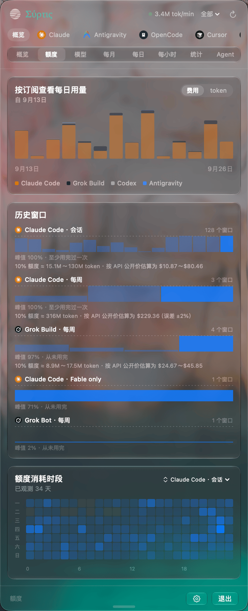
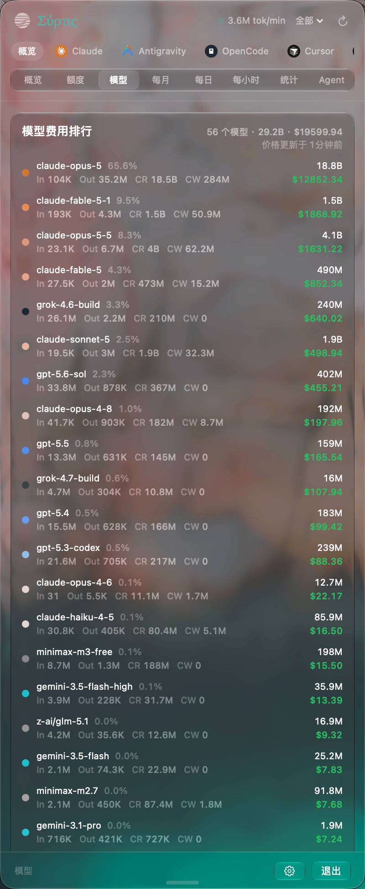
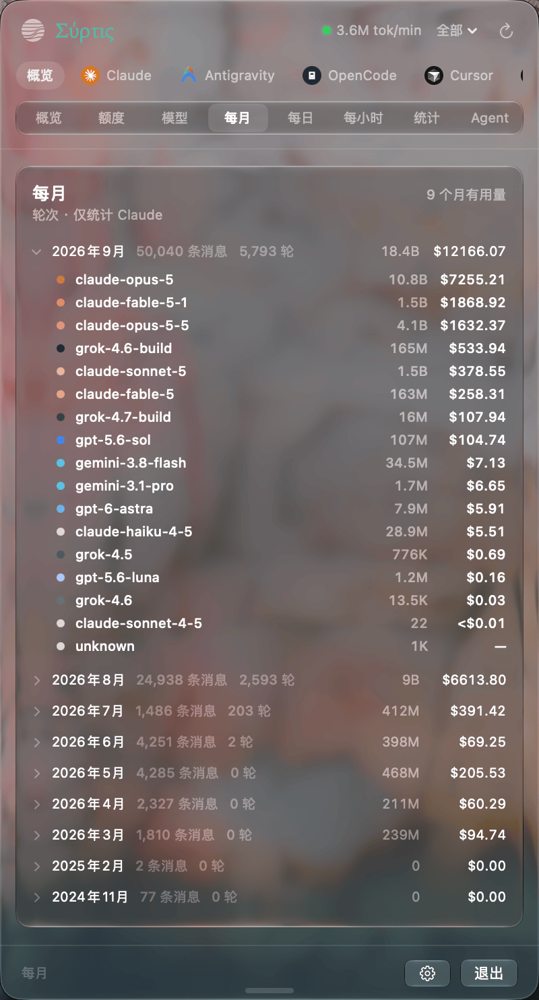
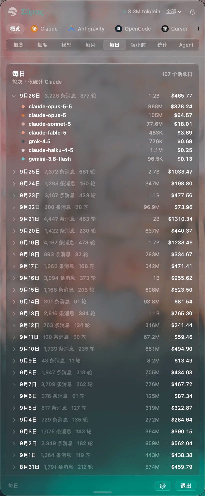
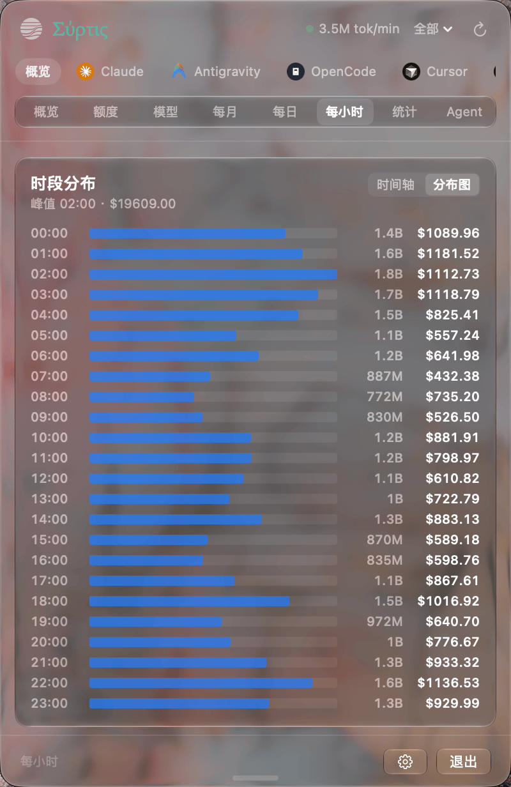
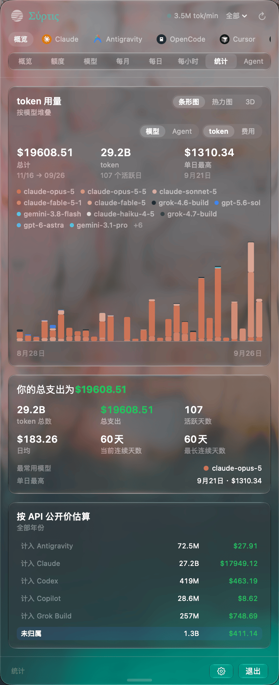
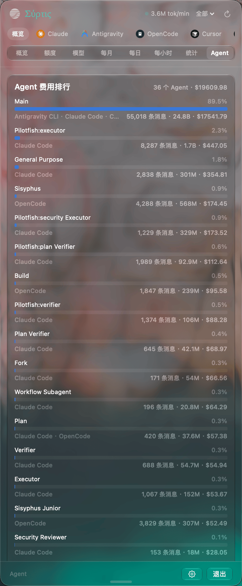
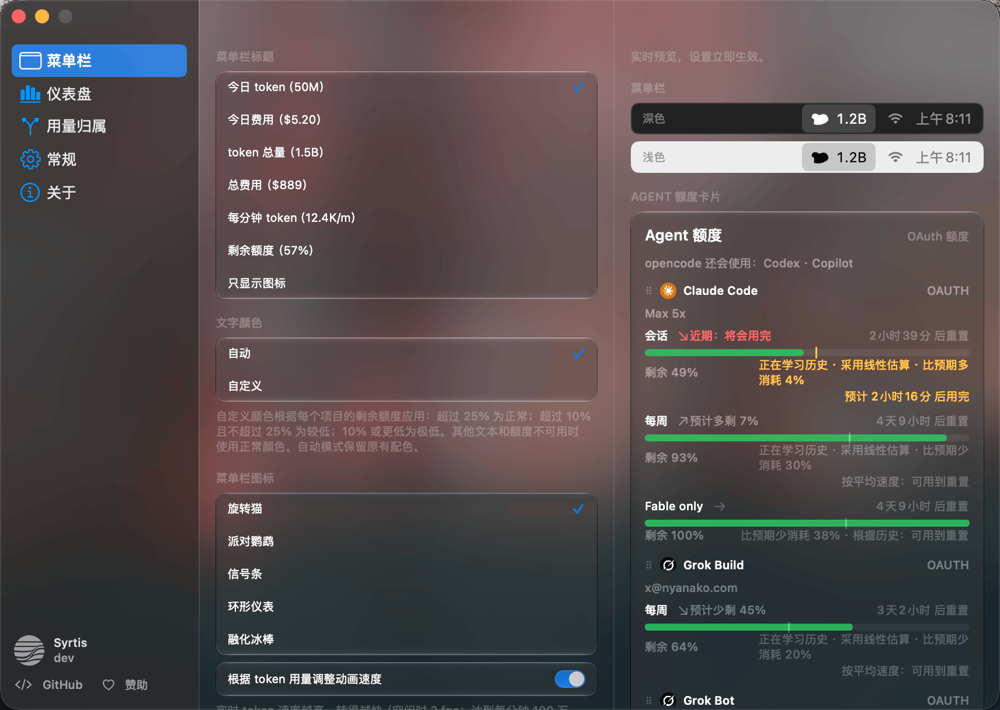

<h1 align="center">Syrtis</h1>

<p align="center">
  <strong>macOS 菜单栏 AI token 用量与额度监控工具 — 原生 Swift、Liquid Glass 设计。</strong>
</p>

<p align="center"><a href="README.md">English</a> · <a href="README.zh-TW.md">繁體中文</a> · <a href="README.zh-CN.md">简体中文</a></p>

<p align="center">
  
  
  
  
  
  
</p>

<br>

**Syrtis** 是一款免费、基于 MIT 协议的开源 macOS 菜单栏软件，直接读取电脑上 AI 编程工具已有的会话日志，实时显示 token 用量、花费与订阅额度。它支持超过 25 款工具——包括 Claude Code、Codex、Cursor、OpenCode、Gemini CLI、Copilot、Kiro 与 Antigravity——完全在本地设备完成解析，无 Dock 图标、不收集遥测数据、无需注册账户，亦不同步至云端。

在 2.0 版本之前，本软件在 macOS 上名为 TokenBar；升级至 2.0 会完整保留原有的偏好设置、历史记录与开机启动项。同时提供基于相同 Rust 核心构建的 Windows 系统托盘版本 [Syrtis](https://github.com/Nanako0129/Syrtis-Windows)。

<p align="center">
  
</p>

菜单栏标题可显示今日 token 用量、花费、实时每分钟消耗速率，或当前窗口剩余的订阅额度——呈现方式包括信号格、环形进度条，或随着时间窗口消耗而逐渐融化的冰棒。菜单栏上的猫咪会随着用量上升越转越快，这一设计源自 Takuto Nakamura 开发的 [RunCat](https://kyome.io/runcat/)。

---

## 仪表盘

点击图标即可展开 Liquid Glass 面板（macOS 27 之前的系统为浮层弹窗 popover）。上方的 **App 标签页**用于筛选要查看的 agent；**视图切换器**提供八种观察维度：概览、额度、模型、每月、每日、每小时、统计与 Agent；此外还能将全年的使用情况呈现为支持任意视角旋转的 3D 图表。

<p align="center">
  
</p>

<table>
  <tr>
    <td align="center" width="50%"><br><sub><b>概览</b> — 最紧绷的额度上限、今日用量与年度概况</sub></td>
    <td align="center" width="50%"><br><sub><b>额度</b> — 历史周期与额度重置时间</sub></td>
  </tr>
  <tr>
    <td align="center" width="50%"><br><sub><b>模型</b> — 按费用排序的各模型用量</sub></td>
    <td align="center" width="50%"><br><sub><b>每月</b> — 活跃月份与单月明细下钻</sub></td>
  </tr>
  <tr>
    <td align="center" width="50%"><br><sub><b>每日</b> — 活跃日期与单日明细下钻</sub></td>
    <td align="center" width="50%"><br><sub><b>每小时</b> — 一天中各时段的 token 消耗分布</sub></td>
  </tr>
  <tr>
    <td align="center" width="50%"><br><sub><b>统计</b> — 核心数据摘要与连续使用天数</sub></td>
    <td align="center" width="50%"><br><sub><b>Agent</b> — 按费用排序的子 Agent</sub></td>
  </tr>
  <tr>
    <td align="center" colspan="2"><br><sub><b>设置</b> — 菜单栏标题、图标与额度数据源</sub></td>
  </tr>
</table>

仪表盘还配备了支持速率预测的 **OAuth 额度卡片**、实时会话追踪、连续使用天数统计，以及完整的键盘控制（⌘1–9 切换标签页、⌘G 开关图表、⌘, 打开设置）。后台刷新失败时绝不会清空既有数值，界面将始终保留最新确认的数据，直至获取到有效的新数据。

## 安装

```sh
brew install --cask nanako0129/tap/syrtis
```

应用内更新通过 Sparkle 交付；可在设置（Settings → "Receive beta updates"）中选择接收测试版本。软件为 ad-hoc 签名，未经 Apple 公证（notarized）；按安装说明所述，Homebrew cask 会在安装时自动移除隔离属性。运行需要搭载 Apple Silicon 芯片的 Mac 且系统为 macOS 14+（Liquid Glass 视觉效果需 macOS 26，毛玻璃面板需 macOS 27；更早的系统会回退至系统材质效果 vibrancy fallback）。从源代码编译需使用 Xcode 27。若仍在 macOS 11–13 环境，最终的 Tauri 构建版本仍以 [`tokenbar@legacy`](https://github.com/Nanako0129/TokenBar-Tauri) 保留。

## 工作原理

数据层完全由 Rust 驱动：以 Git submodule 引入的开源共享引擎 [tokscale-core](https://github.com/Nanako0129/tokscale-core) 负责会话解析、数据去重与费用计算；应用内置的 `crates/tb_core_ffi` 负责额度拉取并导出 C ABI 接口。界面与系统集成由 Swift 构建：包括 SwiftUI 视图、`NSStatusItem` 菜单栏外壳及 Sparkle 更新机制。

```sh
make                        # cargo build --release, then swift build
make run                    # build + launch Syrtis
swift run Syrtis --smoke  # run the FFI smoke test
```

[项目知识库](docs/knowledge/README.md)是了解 Rust 到 Swift 架构、校验机制、共享引擎边界、发布链路与维护规范的标准指南。

> 请在仓库根目录下执行 `swift build` — `Package.swift` 中的链接器路径 `-L target/release`
> 为相对路径。

## 赞助 Syrtis

Syrtis 采用本地优先架构，无需注册 Syrtis 账户，但在 25+ 款 AI 编程工具间保持数据准确是一项繁杂的兼容性工作。解析逻辑的变更涉及 Rust、FFI、Swift 与 Windows 版本；实时额度卡片需要维护真实的 OAuth 或订阅账户及上游 API；发布流程覆盖 macOS 原生行为、Sparkle 签名与 appcast、Homebrew 以及历史版本迁移元数据。

赞助有助于分担测试账户成本、CI 与发布基础设施费用，并支持维护者在上游文件格式变动时持续跟进适配。如果 Syrtis 帮助你清晰掌握了 AI 开销，欢迎在 Patreon 上支持项目的持续开发。

[](https://www.patreon.com/cw/Nanako0129/membership)

## 参与贡献

有关环境配置、改动规范、验证流程及 Pull Request 提交要求，请参阅 [CONTRIBUTING.md](CONTRIBUTING.md)。

## 致谢

Syrtis 基于 Junho Yeo 开发的 **[tokscale](https://github.com/junhoyeo/tokscale)** 构建。Syrtis 的共享引擎 [`tokscale-core`](https://github.com/Nanako0129/tokscale-core) 派生自该核心，用于处理 25+ 款 agent 的会话解析、去重与定价。tokscale 交互式 TUI 亦是整个仪表盘的原型蓝本：概览、模型、每月、每日、每小时、统计与 Agent 等视图维度，以及 `In · Out · CR · CW` 列分布，均以此为基础设计。

该产品线最初源自 handlecusion 开发的 [tokcat](https://github.com/handlecusion/tokcat) 的 fork——即首个基于 tokscale 构建的 Tauri 菜单栏工具。当前的本地应用为完全不含 tokcat 代码的纯 Swift 重写版本，但菜单栏产品形态与旋转猫咪均承袭自该项目；猫咪动画最早可追溯至 Takuto Nakamura 开发的 [RunCat](https://kyome.io/runcat/)。额度进度卡片参考了 Peter Steinberger 开发的 [CodexBar](https://github.com/steipete/CodexBar)。

全部基于 MIT 协议。依据 [MIT](LICENSE) 开源。
