<h1 align="center">Syrtis</h1>

<p align="center">
  <strong>macOS 選單列 AI token 用量與額度監控工具 — 原生 Swift、Liquid Glass 設計。</strong>
</p>

<p align="center"><a href="README.md">English</a> · <a href="README.zh-TW.md">繁體中文</a> · <a href="README.zh-CN.md">简体中文</a></p>

<p align="center">
  
  
  
  
  
  
</p>

<br>

**Syrtis** 是一款免費、MIT 授權且開源的 macOS 選單列軟體，直接讀取電腦上 AI 寫程式工具既有的工作階段紀錄，計算累積的 token、花費與訂閱額度。支援超過 25 款工具——包含 Claude Code、Codex、Cursor、OpenCode、Gemini CLI、Copilot、Kiro 與 Antigravity——全程於本機解析，無 Dock 圖示、不收集遙測資料、無需註冊帳號，亦不同步至雲端。

在 2.0 版本之前，本軟體在 macOS 上名為 TokenBar；升級至 2.0 版會完整保留原有的偏好設定、歷史紀錄與開機啟動項目。另外也提供採用相同 Rust 核心打造的 Windows 系統匣版本 [Syrtis](https://github.com/Nanako0129/Syrtis-Windows)。

<p align="center">
  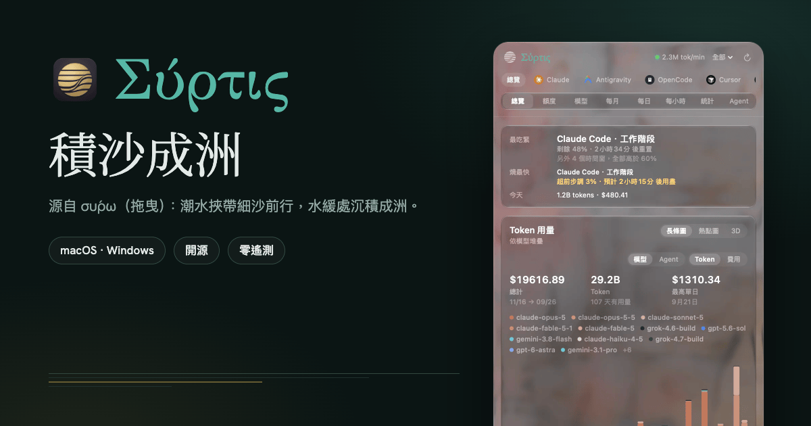
</p>

選單列標題可顯示今日的 token 數量、花費、即時每分鐘 token 消耗速率，或是剩餘的訂閱額度——並以訊號格、環形進度條或隨時間窗消耗而融化的冰棒呈現。選單列上的貓咪會隨著用量攀升越轉越快，這個設計源自 Takuto Nakamura 開發的 [RunCat](https://kyome.io/runcat/)。

---

## 儀表板

點選圖示即可開啟 Liquid Glass 面板（在 macOS 27 之前的系統為彈出視窗 popover）。上方的 **App 標籤頁**可篩選要檢視的 agent；**視圖切換**則提供八種視圖：總覽、額度、模型、每月、每日、每小時、統計與 Agent；此外還能將全年的用量呈現為可自由旋轉視角的 3D 圖表。

<p align="center">
  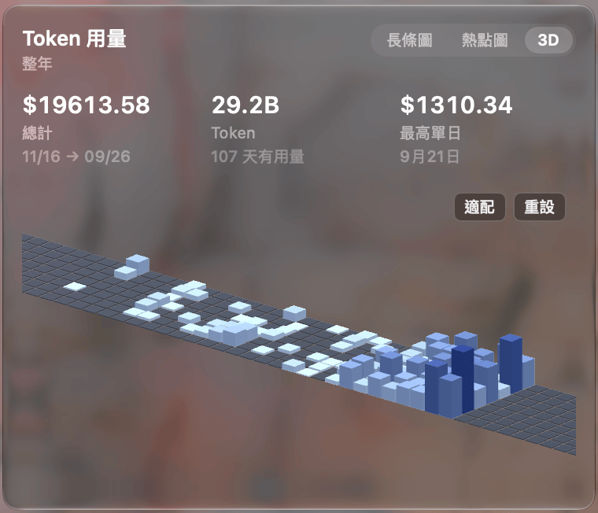
</p>

<table>
  <tr>
    <td align="center" width="50%">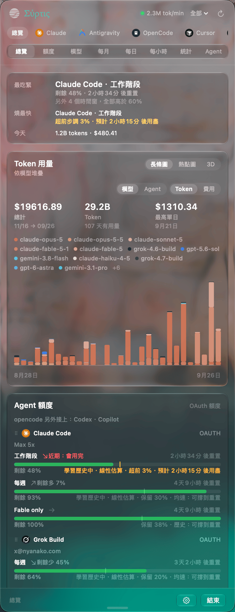<br><sub><b>總覽</b> — 最吃緊的額度上限、今日用量，以及全年概況</sub></td>
    <td align="center" width="50%">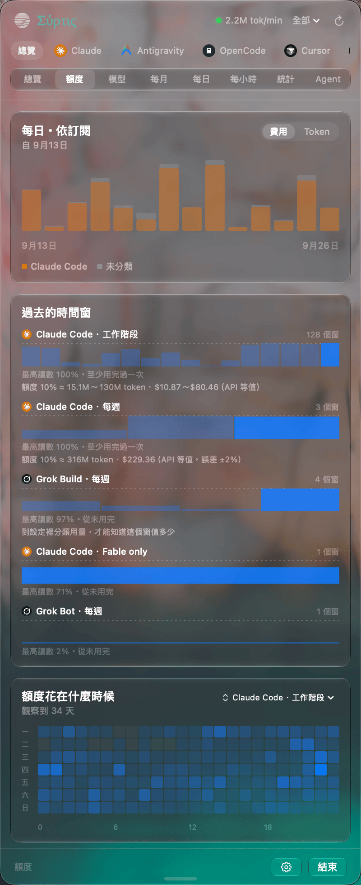<br><sub><b>額度</b> — 歷史週期與額度重置時間</sub></td>
  </tr>
  <tr>
    <td align="center" width="50%">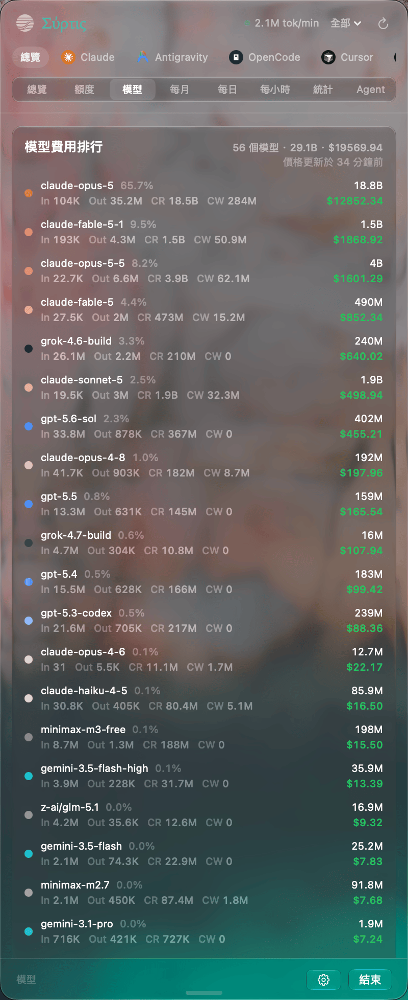<br><sub><b>模型</b> — 依花費排序的各模型用量</sub></td>
    <td align="center" width="50%">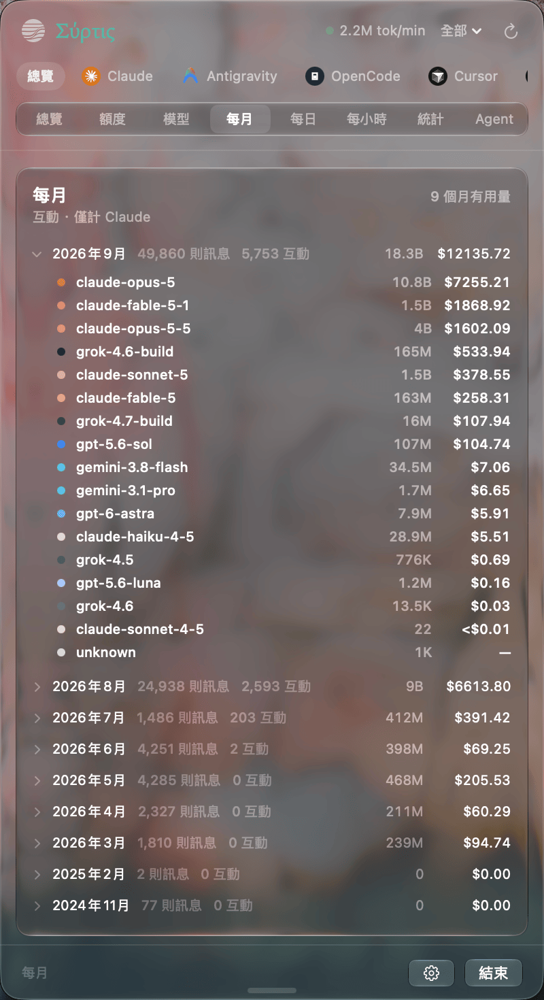<br><sub><b>每月</b> — 活躍月份與單月用量展開</sub></td>
  </tr>
  <tr>
    <td align="center" width="50%">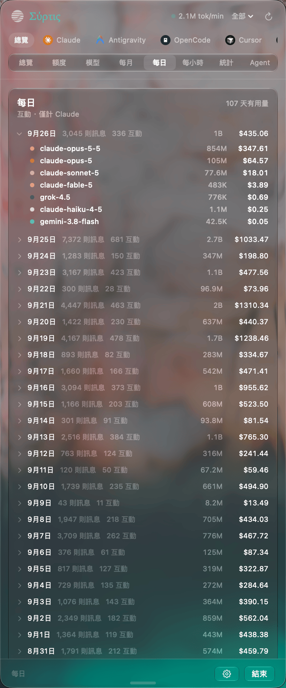<br><sub><b>每日</b> — 活躍日期與單日用量展開</sub></td>
    <td align="center" width="50%">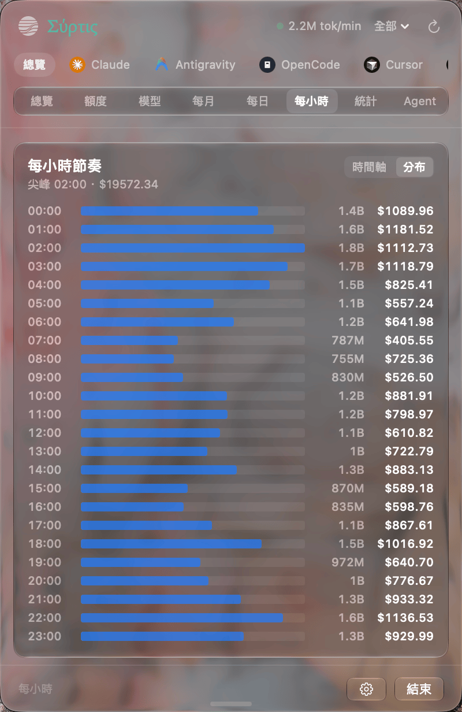<br><sub><b>每小時</b> — 一天之中各時段的 token 消耗分佈</sub></td>
  </tr>
  <tr>
    <td align="center" width="50%">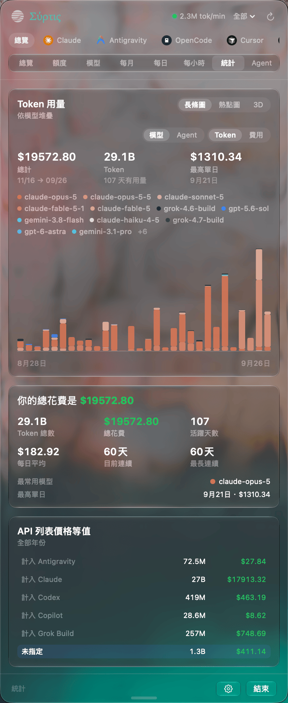<br><sub><b>統計</b> — 重點摘要與連續使用天數</sub></td>
    <td align="center" width="50%">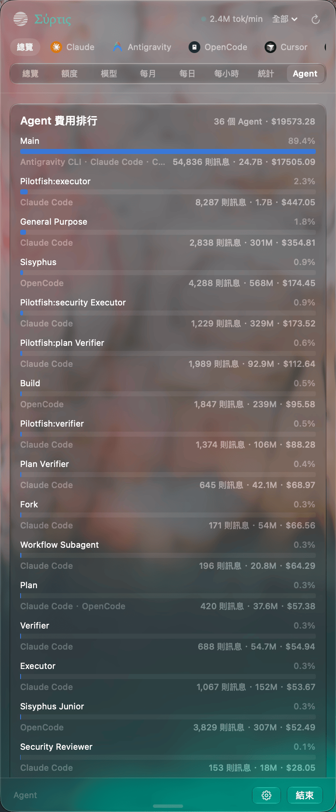<br><sub><b>Agent</b> — 依花費排序的子 agent</sub></td>
  </tr>
  <tr>
    <td align="center" colspan="2">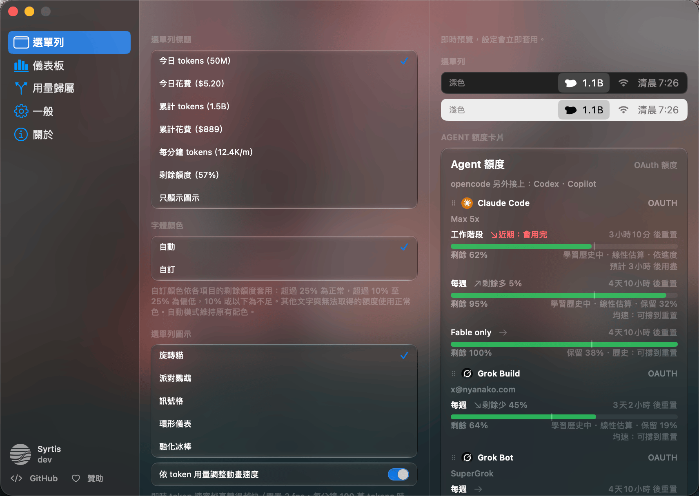<br><sub><b>設定</b> — 選單列標題、圖示與額度資料來源</sub></td>
  </tr>
</table>

此外還包含具備速率預測的 **OAuth 額度卡片**、即時工作階段追蹤、連續使用紀錄，以及完整的鍵盤操作（⌘1–9 切換標籤頁、⌘G 開關圖表、⌘, 開啟設定）。背景重新整理失敗時絕不清空既有數值，介面會持續保留最後確認的數值，直到取得新資料為止。

## 安裝

```sh
brew install --cask nanako0129/tap/syrtis
```

軟體內部更新透過 Sparkle 派送；測試版可於設定（Settings → "Receive beta updates"）中選擇加入。應用程式為 ad-hoc 簽署，未經 Apple 公證（notarized）；正如安裝說明所述，Homebrew cask 會在安裝時自動清除隔離屬性。執行環境需求為搭載 Apple Silicon 晶片的 Mac，且作業系統需為 macOS 14+（Liquid Glass 介面需要 macOS 26，玻璃面板則需要 macOS 27；更早的系統版本會自動退回傳統半透明效果 vibrancy fallback）。從原始碼編譯需要 Xcode 27。若仍在 macOS 11–13 環境，最終的 Tauri 版本依然以 [`tokenbar@legacy`](https://github.com/Nanako0129/TokenBar-Tauri) 維持提供。

## 運作原理

資料處理完全由 Rust 負責：以 Git submodule 形式引入的公開共享引擎 [tokscale-core](https://github.com/Nanako0129/tokscale-core) 負責解析工作階段、去重與計算價格；本專案所屬的 `crates/tb_core_ffi` 則負責額度擷取並公開 C ABI。其餘部分皆由 Swift 負責：包含 SwiftUI 介面、`NSStatusItem` 選單列外殼與 Sparkle 更新機制。

```sh
make                        # cargo build --release, then swift build
make run                    # build + launch Syrtis
swift run Syrtis --smoke  # run the FFI smoke test
```

[專案知識庫](docs/knowledge/README.md)是瞭解 Rust 到 Swift 架構、驗證閘門、共享引擎邊界、發布鏈與維護狀態的正式指引。

> 請在儲存庫根目錄執行 `swift build` — `Package.swift` 中的連結器路徑 `-L target/release`
> 為相對路徑。

## 贊助 Syrtis

Syrtis 堅持本機優先，無需註冊 Syrtis 帳號，但要讓計算結果在 25+ 款 AI 寫程式工具上持續保持可靠，是一項涵蓋廣泛相容性的維護工作。解析器的調整牽涉 Rust、FFI、Swift 與 Windows 版本；即時額度卡片需要維持真實的 OAuth 或訂閱帳號以及供應商 API；發布流程則涵蓋 macOS 原生行為、Sparkle 簽名與 appcast、Homebrew 以及舊版遷移資料。

贊助能協助支應測試帳號費用、CI 與發布基礎設施，以及隨上游檔案格式異動而維護解析器所需的時間。若 Syrtis 協助你看清了 AI 預算的流向，歡迎透過 Patreon 贊助後續的開發。

[](https://www.patreon.com/cw/Nanako0129/membership)

## 參與貢獻

關於環境建置、特定變更指引、驗證方式與 Pull Request 要求，請參閱 [CONTRIBUTING.md](CONTRIBUTING.md)。

## 致謝

Syrtis 建立在 Junho Yeo 所開發的 **[tokscale](https://github.com/junhoyeo/tokscale)** 之上。Syrtis 的共享引擎 [`tokscale-core`](https://github.com/Nanako0129/tokscale-core) 源自該核心，負責超過 25 款 agent 的工作階段解析、去重與計價。tokscale 的互動式 TUI 亦是整個儀表板的架構藍本：總覽、模型、每月、每日、每小時、統計與 Agent 等視圖，以及 `In · Out · CR · CW` 欄位劃分，皆以此為雛形設計。

本產品線最初源自 handlecusion 開發的 [tokcat](https://github.com/handlecusion/tokcat) 的 fork——亦即最早以 tokscale 為基礎打造的 Tauri 選單列工具。當前的原生應用程式則是完全不包含 tokcat 程式碼的原生 Swift 重寫版，但選單列型態與招牌的旋轉貓咪皆源於該專案；貓咪的靈感則可追溯至 Takuto Nakamura 的 [RunCat](https://kyome.io/runcat/)。額度消耗速率卡片則參考了 Peter Steinberger 的 [CodexBar](https://github.com/steipete/CodexBar)。

全數採用 MIT 授權條款。以 [MIT](LICENSE) 授權發布。
